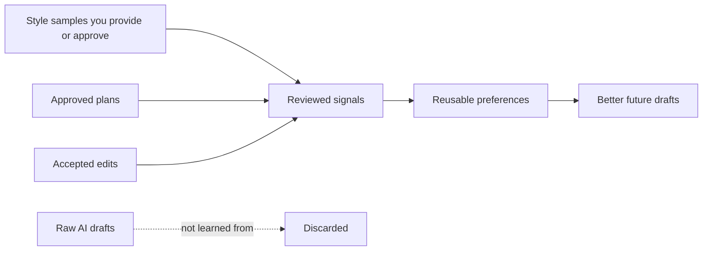

# Writer's Loop

**AI writing that learns from your style, approvals, and edits.**
**让 AI 写作根据你的风格、认可与修改持续改进。**

[](https://github.com/xxsang/writers-loop/actions/workflows/validate.yml)
[](LICENSE)
[](package.json)
[](PRIVACY.md)

Writer's Loop is a portable writing skill for AI agents. It turns writing into
a reviewable loop — frame, plan, draft, critique, revise — and learns only from
style samples you provide or approve and decisions you actually review.

Use it when one-shot prompting is too fuzzy: coding plans, reports, proposals,
product specs, documentation, essays, speeches, fiction, style distillation, and
translation.

---

## The Problem With One-Shot AI Writing

Most writing prompts collapse planning, drafting, editing, and preference
learning into one pass. The agent guesses what you want, rewrites without
asking, and forgets your decisions the moment the conversation ends.

Writer's Loop keeps the stages separate:

| Stage | What happens |
| --- | --- |
| **Frame** | Understand the artifact, audience, goal, and constraints |
| **Ask** | Ask only questions that would materially change the result |
| **Plan** | Propose a structured plan and wait for approval |
| **Draft** | Write once the plan is locked |
| **Critique** | Evaluate the draft before touching it |
| **Propose** | Name targeted changes with reason, scope, and risk |
| **Decide** | You accept, reject, or adjust — the agent does not guess |
| **Revise** | Rewrite only what was approved |
| **Learn** | Record only reviewed decisions as reusable preferences |

Core rule:

```text
Learn from user decisions, not from raw AI drafts.
```



---

## Try It In 30 Seconds

```text
Use $writers-loop for this:
[describe the writing task]

Audience: [who will read it]
Goal: [what it should achieve]

Ask only if blocked. Otherwise make a short plan, draft, and brief critique.
Do not save preferences unless I ask.
```

For more ready-to-copy prompts, see [docs/prompt-templates.md](docs/prompt-templates.md).

---

## What You Get

A structured loop that keeps planning, drafting, and editing separate — so the
output is steerable and reviewed preferences can persist across sessions after
explicit opt-in.
Includes artifact-specific guidance for technical plans, reports, proposals,
docs, essays, speeches, and fiction; style distillation from your own samples;
translation that preserves voice and exact technical tokens; and optional
project-local memory that writes only where you approve it.

---

## Install And Agent Support

Writer's Loop is GitHub-only. Clone the repository, then install with the path
or plugin flow that matches your agent.

```bash
git clone https://github.com/xxsang/writers-loop.git
```

| Agent | Fast path |
| --- | --- |
| **Claude Code** | Copy `skills/writers-loop` into `~/.claude/skills/`, or use `.claude-plugin/plugin.json` |
| **OpenAI Codex CLI** | Copy `skills/writers-loop` into `~/.codex/skills/`, or use `.codex-plugin/plugin.json` |
| **OpenAI Codex App** | Copy `skills/writers-loop` into `~/.codex/skills/` and refresh skill discovery |
| **Cursor** | Use `.cursor-plugin/plugin.json`, or copy the skill folder |
| **Gemini CLI** | Run `gemini extensions install https://github.com/xxsang/writers-loop` |
| **GitHub Copilot CLI** | Point Copilot-enabled workflows at `AGENTS.md` |
| **OpenCode** | Follow `.opencode/INSTALL.md` |
| **ChatGPT / hosted agents** | Paste or attach `skills/writers-loop/SKILL.md` into project instructions |

For full per-agent steps, see [docs/installation.md](docs/installation.md).

No npm install required for normal use. `package.json` is `private: true`; Node
scripts are for validation, evals, and optional local storage tooling only.

---

## Local Memory Is Opt-In

Writer's Loop works without memory. Preference learning is session-only by default.

If you opt in, tools write only inside the selected project:

```text
.writers-loop/
├── journal.jsonl
├── prefs.md
└── styles/
    └── my-style.md
```

- `.writers-loop/` is never created unless you ask.
- Never commit it to public repositories.
- Only reviewed style packs are saved in `.writers-loop/styles/` — not raw source samples.

See [docs/local-preference-storage.md](docs/local-preference-storage.md) for
`style:save` and other commands, and [PRIVACY.md](PRIVACY.md) for the full policy.

---

## When Not To Use It

For tiny one-off copy edits, a simple prompt is usually enough. Writer's Loop
is for writing that benefits from structure, review, or reusable decisions.

Using an LLM for writing may also reduce the pleasure of writing — it can
compress the uncertainty, wandering, discovery, and ownership that make writing
satisfying. Use Writer's Loop as a scaffold, sparring partner, editor, or
translator. Keep the parts of writing you value doing yourself.

---

## Docs

| Need | Read |
| --- | --- |
| Quick example | [docs/demo-transcript.md](docs/demo-transcript.md) |
| Full method | [docs/writers-loop-complete-guide.md](docs/writers-loop-complete-guide.md) |
| Copyable prompts | [docs/prompt-templates.md](docs/prompt-templates.md) |
| Using A Learned Style | [docs/prompt-templates.md#using-a-learned-style](docs/prompt-templates.md#using-a-learned-style) |
| Installation | [docs/installation.md](docs/installation.md) |
| Local preference storage | [docs/local-preference-storage.md](docs/local-preference-storage.md) |
| Privacy policy | [PRIVACY.md](PRIVACY.md) |
| Release checklist | [RELEASE.md](RELEASE.md) |

---

## Repository Layout

<details>
<summary>Show file tree</summary>

```text
skills/writers-loop/SKILL.md               Core skill instructions
skills/writers-loop/references/            Progressive-disclosure references
skills/writers-loop/scripts/journal.mjs    Optional local preference journal
skills/writers-loop/scripts/style-pack.mjs Optional local style-pack storage
docs/                                      User-facing guides and prompt templates
.codex-plugin/plugin.json                  Codex plugin metadata
.claude-plugin/plugin.json                 Claude plugin metadata
.cursor-plugin/plugin.json                 Cursor plugin metadata
gemini-extension.json                      Gemini extension metadata
.opencode/                                 OpenCode install metadata
tools/                                     Maintainer validation and eval scripts
```

</details>

---

## Validate

```bash
npm test
```

No install step required. Uses only Node.js built-in modules.

---

## Contributing

See [CONTRIBUTING.md](CONTRIBUTING.md). Keep the skill portable, concise, and
useful across agents.

## License

MIT
