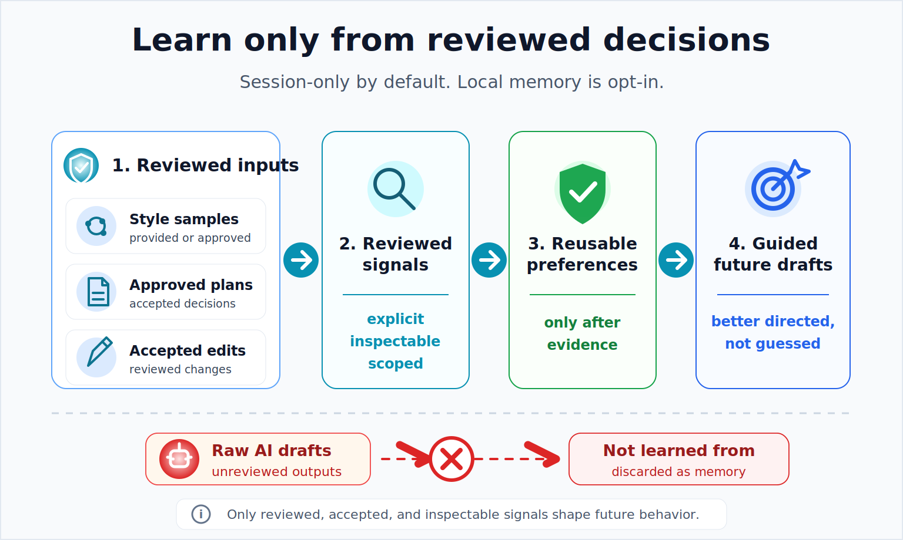
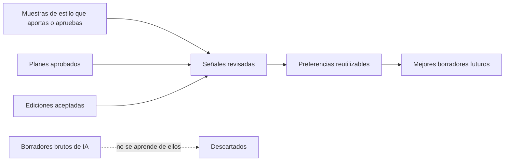

# Writer's Loop

[English](README.md) | [简体中文](README_zh.md) | [日本語](README_ja.md) | Español

**Escritura con IA que aprende de tu estilo, aprobaciones y ediciones.**

[](https://github.com/xxsang/writers-loop/actions/workflows/validate.yml)
[](LICENSE)
[](package.json)
[](PRIVACY.md)

<p align="center">
  
</p>

Writer's Loop es una habilidad de escritura portable para agentes de IA. Convierte la escritura en un bucle revisable — definir el contexto, planificar, redactar, criticar, revisar — y aprende solo de muestras de estilo que aportas o apruebas y de decisiones que realmente revisas.

Úsalo cuando un prompt de una sola pasada es demasiado impreciso: planes técnicos, informes, propuestas, especificaciones de producto, documentación, discursos, ficción, destilación de estilo y traducción.

---

## Instalación en una línea

Si usas Claude Code, Codex, Cursor, Gemini CLI, OpenCode u otro agente local, envía este prompt:

```text
Help me install Writer's Loop from https://github.com/xxsang/writers-loop, then use $writers-loop for my writing task without saving preferences unless I explicitly opt in.
```

Para instalación manual, consulta [docs/installation.md](docs/installation.md). Si tu agente admite plugins de repositorio, usa directamente la URL pública: `https://github.com/xxsang/writers-loop`

---

## El problema con los prompts de una sola pasada

La mayoría de los prompts de escritura colapsan la planificación, el borrador, la edición y el aprendizaje de preferencias en un solo paso. El agente adivina lo que quieres, reescribe sin preguntar y olvida tus decisiones en cuanto termina la conversación.

| Problema | Respuesta de Writer's Loop |
| --- | --- |
| Los borradores únicos adivinan demasiado | Definir el contexto y planificar antes de redactar |
| Las reescrituras pueden borrar la intención | Proponer cambios antes de ejecutarlos |
| La memoria de la IA puede volverse poco fiable | Aprender solo de decisiones revisadas |
| Copiar estilos puede filtrar información privada | Separar los rasgos de estilo del contenido fuente |

Writer's Loop mantiene las etapas separadas:

| Etapa | Qué ocurre |
| --- | --- |
| **Definir** | Entender el tipo de texto, audiencia, objetivo y restricciones |
| **Preguntar** | Solo las preguntas que cambiarían materialmente el resultado |
| **Planificar** | Proponer un plan estructurado y esperar aprobación |
| **Redactar** | Escribir una vez que el plan está fijado |
| **Criticar** | Evaluar el borrador antes de tocarlo |
| **Proponer** | Nombrar los cambios con razón, alcance y riesgo |
| **Decidir** | Tú aceptas, rechazas o ajustas — el agente no adivina |
| **Revisar** | Reescribir solo lo aprobado |
| **Aprender** | Registrar solo las decisiones revisadas como preferencias reutilizables |

Regla central:

```text
Aprender de las decisiones del usuario, no de borradores de IA sin revisar.
```



---

## Empieza en 30 segundos

```text
Use $writers-loop for this:
[describe la tarea de escritura]

Audience: [quién lo leerá]
Goal: [qué debe lograr]

Ask only if blocked. Otherwise make a short plan, draft, and brief critique.
Do not save preferences unless I ask.
```

(`$writers-loop` es la sintaxis de invocación del skill y se mantiene en inglés. Los campos descriptivos pueden completarse en español.)

Para más prompts listos para copiar, consulta [docs/prompt-templates.md](docs/prompt-templates.md).

---

## Qué obtienes

Un bucle estructurado que mantiene la planificación, el borrador y la edición por separado — para que el resultado sea dirigible y las preferencias revisadas puedan persistir entre sesiones tras un opt-in explícito. Incluye guía específica para planes técnicos, informes, propuestas, documentación, ensayos, discursos y ficción; destilación de estilo a partir de tus propias muestras; traducción que preserva la voz y los tokens técnicos exactos; y memoria local opcional que escribe solo donde tú lo apruebas.

---

## Instalación y compatibilidad con agentes

Writer's Loop está alojado en GitHub y es público. Si tu agente admite plugins de repositorio, instala desde:

```text
https://github.com/xxsang/writers-loop
```

Para instalación en carpeta de skills local, clona el repositorio e instala con la ruta o el flujo de plugin que corresponda a tu agente.

```bash
git clone https://github.com/xxsang/writers-loop.git
```

| Agente | Método rápido |
| --- | --- |
| **Claude Code** | Copia `skills/writers-loop` en `~/.claude/skills/`, o usa `.claude-plugin/plugin.json` |
| **OpenAI Codex CLI** | Usa el flujo de plugin con la URL de GitHub si está disponible, o copia en `~/.codex/skills/` |
| **OpenAI Codex App** | Usa el flujo de plugin con la URL de GitHub si está disponible, o copia en `~/.codex/skills/` y actualiza el descubrimiento de skills |
| **Cursor** | Usa `.cursor-plugin/plugin.json`, o copia la carpeta del skill |
| **Gemini CLI** | Ejecuta `gemini extensions install https://github.com/xxsang/writers-loop` |
| **GitHub Copilot CLI** | Apunta los flujos de trabajo habilitados para Copilot a `AGENTS.md` |
| **OpenCode** | Sigue `.opencode/INSTALL.md` |
| **ChatGPT / agentes alojados** | Pega o adjunta `skills/writers-loop/SKILL.md` en las instrucciones del proyecto |

Para pasos detallados por agente, consulta [docs/installation.md](docs/installation.md).

No hace falta `npm install` para el uso normal. `package.json` está marcado como `private: true`; los scripts de Node son solo para validación, evaluaciones y herramientas opcionales de almacenamiento local.

---

## Plantillas para herramientas de escritura

Writer's Loop también incluye plantillas para superficies de escritura que no ejecutan skills de forma nativa. Están enlazadas desde la [guía de integración de herramientas de escritura](docs/writing-tools.md).

| Herramienta | Ruta rápida |
| --- | --- |
| **Obsidian** | Copia `integrations/obsidian/templates/` en la carpeta de plantillas de tu vault |
| **Logseq** | Copia `integrations/logseq/templates/writers-loop.md` en una página de plantillas |
| **Notion** | Pega `integrations/notion/writers-loop-page-template.md` en una página |
| **Feishu / Lark Docs** | Pega o crea `integrations/feishu/writers-loop-doc-template.md` |
| **ChatGPT / Claude Projects** | Pega las instrucciones del proyecto y adjunta las referencias de Writer's Loop indicadas |

Configuración rápida para Obsidian:

```bash
VAULT="$HOME/Documents/Obsidian/MyVault"
mkdir -p "$VAULT/Templates/Writers Loop"
cp integrations/obsidian/templates/*.md "$VAULT/Templates/Writers Loop/"
```

Luego activa el plugin central **Templates** de Obsidian y establece la carpeta de plantillas en `Templates/Writers Loop`.

---

## La memoria local es opt-in

Writer's Loop funciona sin memoria. El aprendizaje de preferencias es solo de sesión por defecto.

Si optas por almacenamiento local, las herramientas escriben solo dentro del proyecto seleccionado:

```text
.writers-loop/
├── journal.jsonl
├── prefs.md
└── styles/
    └── my-style.md
```

- `.writers-loop/` nunca se crea sin tu aprobación.
- No lo subas a repositorios públicos.
- Solo se guardan paquetes de estilo revisados en `.writers-loop/styles/` — no muestras privadas sin procesar.

Consulta [docs/local-preference-storage.md](docs/local-preference-storage.md) para los comandos `style:save` y otros, y [PRIVACY.md](PRIVACY.md) para la política completa de privacidad.

---

## Cuándo no usarlo

Para correcciones pequeñas y puntuales, un prompt simple suele bastar. Writer's Loop es para escritura que se beneficia de estructura, revisión o decisiones reutilizables.

Usar un LLM para escribir también puede reducir el placer de escribir — puede comprimir la incertidumbre, el desvío, el descubrimiento y la sensación de autoría que hacen satisfactoria la escritura. Usa Writer's Loop como andamiaje, contraparte, editor o traductor. Conserva para ti las partes de escribir que valoras hacer por tu cuenta.

---

## Documentación

| Necesidad | Enlace |
| --- | --- |
| Ejemplo rápido | [docs/demo-transcript.md](docs/demo-transcript.md) |
| Método completo | [docs/writers-loop-complete-guide.md](docs/writers-loop-complete-guide.md) |
| Prompts para copiar | [docs/prompt-templates.md](docs/prompt-templates.md) |
| Integraciones con herramientas de escritura | [docs/writing-tools.md](docs/writing-tools.md) |
| Usar un estilo aprendido | [docs/prompt-templates.md#using-a-learned-style](docs/prompt-templates.md#using-a-learned-style) |
| Instalación | [docs/installation.md](docs/installation.md) |
| Almacenamiento local de preferencias | [docs/local-preference-storage.md](docs/local-preference-storage.md) |
| Política de privacidad | [PRIVACY.md](PRIVACY.md) |
| Lista de verificación de lanzamiento | [RELEASE.md](RELEASE.md) |

---

## Estructura del repositorio

<details>
<summary>Mostrar árbol de archivos</summary>

```text
skills/writers-loop/SKILL.md               Instrucciones del skill principal
skills/writers-loop/references/            Referencias de divulgación progresiva
skills/writers-loop/scripts/journal.mjs    Diario local de preferencias (opcional)
skills/writers-loop/scripts/style-pack.mjs Almacenamiento local de paquetes de estilo (opcional)
docs/                                      Guías de usuario y plantillas de prompts
.codex-plugin/plugin.json                  Metadatos del plugin de Codex
.claude-plugin/plugin.json                 Metadatos del plugin de Claude
.cursor-plugin/plugin.json                 Metadatos del plugin de Cursor
gemini-extension.json                      Metadatos de la extensión de Gemini
.opencode/                                 Metadatos de instalación de OpenCode
tools/                                     Scripts de validación y evaluación para mantenedores
```

</details>

---

## Validación

```bash
npm test
```

No se requiere paso de instalación. Usa solo módulos integrados de Node.js.

---

## Contribuir

Consulta [CONTRIBUTING.md](CONTRIBUTING.md). Mantén el skill portable, conciso y útil en todos los agentes.

## License

MIT License. See [LICENSE](LICENSE).

Copyright (c) 2026 Writer's Loop contributors.
