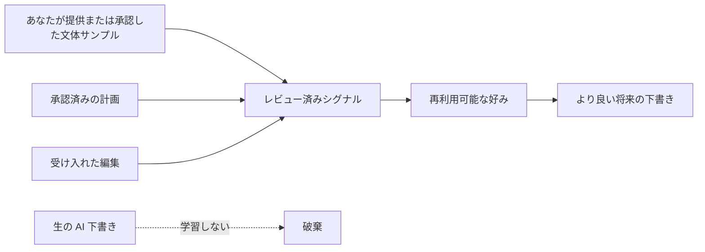

# Writer's Loop

[English](README.md) | [简体中文](README_zh.md) | 日本語 | [Español](README_es.md)

**あなたの文体・承認・編集から学び、改善し続ける AI ライティング。**

[](https://github.com/xxsang/writers-loop/actions/workflows/validate.yml)
[](LICENSE)
[](package.json)
[](PRIVACY.md)

<p align="center">
  
</p>

Writer's Loop は、AI エージェント向けのポータブルなライティングスキルです。文章作成を確認可能なループに変えます——目的の整理、計画、下書き、批評、修正。学習するのは、あなたが提供または承認した文体サンプルと、実際にレビューした意思決定だけです。

一発プロンプトでは曖昧すぎる場面に使ってください: 技術計画、レポート、提案書、製品仕様、ドキュメント、スピーチ、小説、文体の抽出、翻訳。

---

## エージェントへの一行セットアップ

Claude Code、Codex、Cursor、Gemini CLI、OpenCode などのローカルエージェントを使っている場合は、このプロンプトを送るだけです:

```text
Help me install Writer's Loop from https://github.com/xxsang/writers-loop, then use $writers-loop for my writing task without saving preferences unless I explicitly opt in.
```

手動インストールは [docs/installation.md](docs/installation.md) を参照してください。リポジトリプラグインに対応したエージェントであれば、公開 URL をそのまま使えます: `https://github.com/xxsang/writers-loop`

---

## 一発プロンプトの問題

多くの文章プロンプトは、計画・下書き・編集・好みの学習をすべて一回の処理に詰め込みます。エージェントはあなたの意図を推測し、確認なしに書き直し、会話が終わると決定事項をすべて忘れます。

| 問題 | Writer's Loop の対応 |
| --- | --- |
| 一発下書きは推測に頼りすぎる | 下書き前にタスクを整理して計画を立てる |
| 書き直しが意図を消すことがある | 修正を提案してから実行する |
| AI の記憶は不安定になりやすい | レビュー済みの意思決定からのみ学習する |
| 文体のコピーが私的情報を漏らすことがある | 文体の特徴と原文の内容を分離する |

Writer's Loop は各ステージを独立させます:

| ステージ | 内容 |
| --- | --- |
| **整理** | 成果物の種類・読者・目的・制約を把握する |
| **質問** | 結果に実質的な影響を与える質問だけをする |
| **計画** | 構造化した計画を提案し、承認を待つ |
| **下書き** | 計画が固まってから書き始める |
| **批評** | 手を加える前に下書きを評価する |
| **提案** | 変更の理由・範囲・リスクを明示する |
| **決定** | あなたが承認・却下・調整する——エージェントは推測しない |
| **修正** | 承認された部分だけを書き直す |
| **学習** | レビュー済みの意思決定だけを再利用可能な好みとして記録する |

基本ルール:

```text
ユーザーの意思決定から学習し、未レビューの AI 下書きからは学習しない。
```



---

## 30 秒で始める

```text
Use $writers-loop for this:
[執筆タスクを説明]

Audience: [誰が読むか]
Goal: [何を達成すべきか]

Ask only if blocked. Otherwise make a short plan, draft, and brief critique.
Do not save preferences unless I ask.
```

（`$writers-loop` はスキル呼び出し構文のため英語のまま使用します。各フィールドの説明は日本語で入力できます。）

コピーして使えるプロンプトの一覧は [docs/prompt-templates.md](docs/prompt-templates.md) を参照してください。

---

## 何が得られるか

計画・下書き・編集を分離した構造化ループにより、出力が操作しやすくなり、明示的なオプトイン後はレビュー済みの好みをセッションをまたいで引き継げます。技術計画・レポート・提案書・ドキュメント・エッセイ・スピーチ・小説に特化したガイダンス、自分のサンプルからの文体抽出、語調と専門用語を保持する翻訳、そして承認した場所にのみ書き込むプロジェクトローカルメモリが含まれます。

---

## インストールとエージェント対応

Writer's Loop は GitHub のみで公開されています。リポジトリプラグインに対応したエージェントであれば、以下からインストールできます:

```text
https://github.com/xxsang/writers-loop
```

ローカルスキルフォルダへのインストールは、リポジトリをクローンしてから各エージェントに合わせたパスにコピーしてください。

```bash
git clone https://github.com/xxsang/writers-loop.git
```

| エージェント | インストール方法 |
| --- | --- |
| **Claude Code** | `skills/writers-loop` を `~/.claude/skills/` にコピー、または `.claude-plugin/plugin.json` を使用 |
| **OpenAI Codex CLI** | 利用可能であれば GitHub URL でプラグインフローを使用、または `~/.codex/skills/` にコピー |
| **OpenAI Codex App** | 利用可能であれば GitHub URL でプラグインフローを使用、または `~/.codex/skills/` にコピーしてスキル検出を更新 |
| **Cursor** | `.cursor-plugin/plugin.json` を使用、またはスキルフォルダをコピー |
| **Gemini CLI** | `gemini extensions install https://github.com/xxsang/writers-loop` を実行 |
| **GitHub Copilot CLI** | Copilot 対応ワークフローを `AGENTS.md` に向ける |
| **OpenCode** | `.opencode/INSTALL.md` に従う |
| **ChatGPT / ホスト型エージェント** | `skills/writers-loop/SKILL.md` をプロジェクト指示に貼り付けまたは添付 |

各エージェントの詳細な手順は [docs/installation.md](docs/installation.md) を参照してください。

通常の使用に `npm install` は不要です。`package.json` は `private: true` に設定されており、Node スクリプトは検証・評価・任意のローカルストレージツールにのみ使用します。

---

## ライティングツールテンプレート

Writer's Loop は、スキルをネイティブに実行できないライティングツール向けのテンプレートも提供しています。詳細は[ライティングツール統合ガイド](docs/writing-tools.md)を参照してください。

| ツール | 簡単な方法 |
| --- | --- |
| **Obsidian** | `integrations/obsidian/templates/` を Vault のテンプレートフォルダにコピー |
| **Logseq** | `integrations/logseq/templates/writers-loop.md` をテンプレートページにコピー |
| **Notion** | `integrations/notion/writers-loop-page-template.md` をページに貼り付け |
| **Feishu / Lark Docs** | `integrations/feishu/writers-loop-doc-template.md` を貼り付けまたは作成 |
| **ChatGPT / Claude Projects** | プロジェクト指示を貼り付け、Writer's Loop の参照ファイルを添付 |

Obsidian のクイックセットアップ:

```bash
VAULT="$HOME/Documents/Obsidian/MyVault"
mkdir -p "$VAULT/Templates/Writers Loop"
cp integrations/obsidian/templates/*.md "$VAULT/Templates/Writers Loop/"
```

その後、Obsidian の**テンプレート**コアプラグインを有効にし、テンプレートフォルダを `Templates/Writers Loop` に設定してください。

---

## ローカルメモリはオプトイン制

Writer's Loop はメモリなしで動作します。好みの学習はデフォルトでセッション内のみです。

オプトインした場合、ツールは選択したプロジェクト内にのみ書き込みます:

```text
.writers-loop/
├── journal.jsonl
├── prefs.md
└── styles/
    └── my-style.md
```

- `.writers-loop/` はあなたの確認なしには作成されません。
- `.writers-loop/` を公開リポジトリにコミットしないでください。
- 保存されるのはレビュー済みのスタイルパックだけで、生の私的サンプルは保存しません。

`style:save` などのコマンドは [docs/local-preference-storage.md](docs/local-preference-storage.md) を、完全なプライバシーポリシーは [PRIVACY.md](PRIVACY.md) を参照してください。

---

## 向かない用途

ごく小さな単発の文言修正には、通常のプロンプトで十分です。Writer's Loop は構造・レビュー・再利用可能な判断が重要な文章向けです。

LLM を使った文章作成は、書く楽しさを減らすこともあります——文章を書くうえで面白い不確実さ、寄り道、発見、自分の手で作っている感覚を圧縮してしまうためです。Writer's Loop は足場、壁打ち相手、編集者、翻訳者として使い、自分にとって大切な書く部分は自分で残してください。

---

## ドキュメント

| 目的 | リンク |
| --- | --- |
| クイック例 | [docs/demo-transcript.md](docs/demo-transcript.md) |
| 完全なメソッド | [docs/writers-loop-complete-guide.md](docs/writers-loop-complete-guide.md) |
| コピー可能なプロンプト | [docs/prompt-templates.md](docs/prompt-templates.md) |
| ライティングツール連携 | [docs/writing-tools.md](docs/writing-tools.md) |
| 学習済みスタイルの使用 | [docs/prompt-templates.md#using-a-learned-style](docs/prompt-templates.md#using-a-learned-style) |
| インストール | [docs/installation.md](docs/installation.md) |
| ローカル設定と好みの保存 | [docs/local-preference-storage.md](docs/local-preference-storage.md) |
| プライバシーポリシー | [PRIVACY.md](PRIVACY.md) |
| リリースチェックリスト | [RELEASE.md](RELEASE.md) |

---

## リポジトリ構成

<details>
<summary>ファイルツリーを表示</summary>

```text
skills/writers-loop/SKILL.md               コアスキル指示
skills/writers-loop/references/            段階的開示リファレンス
skills/writers-loop/scripts/journal.mjs    任意のローカル好みジャーナル
skills/writers-loop/scripts/style-pack.mjs 任意のローカルスタイルパックストレージ
docs/                                      ユーザー向けガイドとプロンプトテンプレート
.codex-plugin/plugin.json                  Codex プラグインメタデータ
.claude-plugin/plugin.json                 Claude プラグインメタデータ
.cursor-plugin/plugin.json                 Cursor プラグインメタデータ
gemini-extension.json                      Gemini 拡張メタデータ
.opencode/                                 OpenCode インストールメタデータ
tools/                                     メンテナー向け検証・評価スクリプト
```

</details>

---

## 検証

```bash
npm test
```

インストール手順は不要です。Node.js の組み込みモジュールのみ使用します。

---

## コントリビュート

[CONTRIBUTING.md](CONTRIBUTING.md) を参照してください。スキルのポータビリティ・簡潔さ・各エージェントでの実用性を維持してください。

## License

MIT License. See [LICENSE](LICENSE).

Copyright (c) 2026 Writer's Loop contributors.
