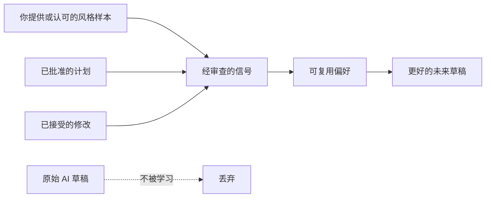

# Writer's Loop

[English](README.md) | 简体中文 | [日本語](README_ja.md) | [Español](README_es.md)

**让 AI 写作根据你的风格、认可与修改持续改进。**

[](https://github.com/xxsang/writers-loop/actions/workflows/validate.yml)
[](LICENSE)
[](package.json)
[](PRIVACY.md)

<p align="center">
  
</p>

Writer's Loop 是一个可移植的 AI 写作技能。它把写作拆成可审查的流程——明确目标、规划、起草、评审、修改——只从你提供或认可的风格样本和你实际审查过的决策中学习。

适用场景：技术方案、报告、提案、产品规格、文档、演讲稿、小说、风格提炼、翻译——一切用一次性提示词难以说清的写作任务。

---

## 用一句话让 Agent 完成安装

如果你使用 Claude Code、Codex、Cursor、Gemini CLI、OpenCode 或类似本地 Agent，直接发送：

```text
Help me install Writer's Loop from https://github.com/xxsang/writers-loop, then use $writers-loop for my writing task without saving preferences unless I explicitly opt in.
```

手动安装步骤见 [docs/installation.md](docs/installation.md)。若你的 Agent 支持仓库插件，直接使用公开地址：`https://github.com/xxsang/writers-loop`。

---

## 一次性提示词的问题

大多数写作提示词把规划、起草、编辑和偏好学习全压缩进一次交互。Agent 靠猜测理解你的意图，不问就改写，对话结束后忘掉一切。

| 问题 | Writer's Loop 的应对方式 |
| --- | --- |
| 一次性起草靠猜测 | 先明确目标和计划，再动笔 |
| 改写可能抹去原意 | 先提出修改方案，再执行 |
| AI 记忆难以可靠 | 只从经过审查的决策中学习 |
| 风格复制可能泄露私人信息 | 将风格特征与原始内容分离 |

Writer's Loop 把各阶段独立拆开：

| 阶段 | 内容 |
| --- | --- |
| **明确目标** | 理解作品类型、读者、目的和约束 |
| **提问** | 只问会实质影响结果的问题 |
| **规划** | 提出结构化计划并等待确认 |
| **起草** | 计划确定后再动笔 |
| **评审** | 在修改前先评估草稿 |
| **提案** | 说明修改的理由、范围和风险 |
| **决策** | 你来接受、拒绝或调整——Agent 不猜测 |
| **修改** | 只改经过确认的部分 |
| **学习** | 只将审查过的决策记录为可复用偏好 |

核心规则：

```text
只从用户决策中学习，不从未经审查的 AI 草稿中学习。
```



---

## 30 秒开始

```text
Use $writers-loop for this:
[描述写作任务]

Audience: [读者是谁]
Goal: [这份文本要达成什么目标]

Ask only if blocked. Otherwise make a short plan, draft, and brief critique.
Do not save preferences unless I ask.
```

（`$writers-loop` 为技能调用语法，保持英文；字段描述可以用中文填写。）

更多可直接复制的提示词，见 [docs/prompt-templates.md](docs/prompt-templates.md)。

---

## 你能得到什么

一个把规划、起草和编辑分开的结构化流程——让输出可控，让偏好在会话间积累（需主动开启）。包含针对技术方案、报告、提案、文档、文章、演讲稿和小说的专项指引；从你自己的样本中提炼风格；保留语气和专业术语的翻译；以及只在你授权的项目下写入的本地记忆。

---

## 安装与 Agent 支持

Writer's Loop 托管在 GitHub，完全公开。若你的 Agent 支持仓库插件，从以下地址安装：

```text
https://github.com/xxsang/writers-loop
```

本地技能目录安装：先克隆仓库，再按对应 Agent 的路径复制。

```bash
git clone https://github.com/xxsang/writers-loop.git
```

### 本地快速安装

仓库根目录就是插件根目录，已包含 `.codex-plugin/`、`.claude-plugin/`、
`.cursor-plugin/`、`gemini-extension.json` 和 `skills/`。可安装技能位于
`skills/writers-loop/`；不要创建重复的 `plugins/writers-loop` 目录。

Codex 本地技能目录：

```bash
tmp="$(mktemp -d)" &&
  git clone --depth 1 https://github.com/xxsang/writers-loop.git "$tmp/writers-loop" &&
  mkdir -p ~/.codex/skills/writers-loop &&
  cp -R "$tmp/writers-loop/skills/writers-loop/"* ~/.codex/skills/writers-loop/
```

Claude Code 本地技能目录：

```bash
tmp="$(mktemp -d)" &&
  git clone --depth 1 https://github.com/xxsang/writers-loop.git "$tmp/writers-loop" &&
  mkdir -p ~/.claude/skills/writers-loop &&
  cp -R "$tmp/writers-loop/skills/writers-loop/"* ~/.claude/skills/writers-loop/
```

正常使用不需要 `npm install`。若安装后启用本地记忆，只有在你明确同意后才会在所选项目内创建 `.writers-loop/`；已审查的风格包只能保存到 `.writers-loop/styles/`。

| Agent | 安装方式 |
| --- | --- |
| **Claude Code** | 将 `skills/writers-loop` 复制到 `~/.claude/skills/`，或使用 `.claude-plugin/plugin.json` |
| **OpenAI Codex CLI** | 使用 GitHub URL 通过插件流安装（若支持），或复制到 `~/.codex/skills/` |
| **OpenAI Codex App** | 使用 GitHub URL 通过插件流安装（若支持），或复制到 `~/.codex/skills/` 后刷新技能发现 |
| **Cursor** | 使用 `.cursor-plugin/plugin.json`，或复制技能目录 |
| **Gemini CLI** | 运行 `gemini extensions install https://github.com/xxsang/writers-loop` |
| **GitHub Copilot CLI** | 将 Copilot 工作流指向 `AGENTS.md` |
| **OpenCode** | 参照 `.opencode/INSTALL.md` |
| **ChatGPT / 其他托管 Agent** | 将 `skills/writers-loop/SKILL.md` 粘贴或附加到项目说明中 |

完整安装步骤见 [docs/installation.md](docs/installation.md)。

正常使用不需要 `npm install`。`package.json` 标记为 `private: true`；Node 脚本仅用于验证、评测和可选的本地存储工具。

---

## 写作工具模板

Writer's Loop 也为不原生支持技能的写作工具提供模板，详见[写作工具集成指南](docs/writing-tools.md)。

| 工具 | 快速路径 |
| --- | --- |
| **Obsidian** | 将 `integrations/obsidian/templates/` 复制到 Vault 的模板文件夹 |
| **Logseq** | 将 `integrations/logseq/templates/writers-loop.md` 复制到模板页面 |
| **Notion** | 将 `integrations/notion/writers-loop-page-template.md` 粘贴到页面中 |
| **飞书文档** | 粘贴或创建 `integrations/feishu/writers-loop-doc-template.md` |
| **ChatGPT / Claude Projects** | 粘贴项目说明并附加所列 Writer's Loop 参考文件 |

Obsidian 快速配置：

```bash
VAULT="$HOME/Documents/Obsidian/MyVault"
mkdir -p "$VAULT/Templates/Writers Loop"
cp integrations/obsidian/templates/*.md "$VAULT/Templates/Writers Loop/"
```

然后在 Obsidian 中启用**模板**核心插件，并将模板文件夹设置为 `Templates/Writers Loop`。

---

## 本地记忆默认关闭

Writer's Loop 无需记忆即可使用。偏好学习默认只在当前会话中有效。

主动开启本地持久化后，工具只在所选项目内创建：

```text
.writers-loop/
├── journal.jsonl
├── prefs.md
└── styles/
    └── my-style.md
```

- 未经你的确认，`.writers-loop/` 不会被创建。
- 不要将 `.writers-loop/` 提交到公开仓库。
- 只将经过审查的风格包保存到 `.writers-loop/styles/`，不保存原始私人样本。

`style:save` 等命令详见 [docs/local-preference-storage.md](docs/local-preference-storage.md)，完整隐私政策见 [PRIVACY.md](PRIVACY.md)。

---

## 不适合的场景

对于简单的一次性改字，普通提示词就够了。Writer's Loop 适合需要结构、审查或可复用决策的写作。

使用 LLM 写作也可能减少写作本身的乐趣——它会压缩让写作有意思的不确定性、游走、发现和拥有感。把 Writer's Loop 当作脚手架、陪练、编辑或翻译工具；你珍视的写作部分，仍然留给自己完成。

---

## 文档

| 需要 | 链接 |
| --- | --- |
| 快速示例 | [docs/demo-transcript.md](docs/demo-transcript.md) |
| 完整方法论 | [docs/writers-loop-complete-guide.md](docs/writers-loop-complete-guide.md) |
| 可复制提示词 | [docs/prompt-templates.md](docs/prompt-templates.md) |
| 写作工具集成 | [docs/writing-tools.md](docs/writing-tools.md) |
| 使用已学风格 | [docs/prompt-templates.md#using-a-learned-style](docs/prompt-templates.md#using-a-learned-style) |
| 安装说明 | [docs/installation.md](docs/installation.md) |
| 本地偏好存储 | [docs/local-preference-storage.md](docs/local-preference-storage.md) |
| 隐私政策 | [PRIVACY.md](PRIVACY.md) |
| 发布检查清单 | [RELEASE.md](RELEASE.md) |

---

## 仓库结构

<details>
<summary>展开文件树</summary>

```text
skills/writers-loop/SKILL.md               核心技能指令
skills/writers-loop/references/            渐进式参考文档
skills/writers-loop/scripts/journal.mjs    可选本地偏好日志
skills/writers-loop/scripts/style-pack.mjs 可选本地风格包存储
docs/                                      用户指南与提示词模板
.codex-plugin/plugin.json                  Codex 插件元数据
.claude-plugin/plugin.json                 Claude 插件元数据
.cursor-plugin/plugin.json                 Cursor 插件元数据
gemini-extension.json                      Gemini 扩展元数据
.opencode/                                 OpenCode 安装元数据
tools/                                     维护者验证与评测脚本
```

</details>

---

## 验证

```bash
npm test
```

无需安装步骤，仅使用 Node.js 内置模块。

---

## 贡献

见 [CONTRIBUTING.md](CONTRIBUTING.md)。保持技能的可移植性、简洁性和跨 Agent 的实用性。

## License

MIT License. See [LICENSE](LICENSE).

Copyright (c) 2026 Writer's Loop contributors.
